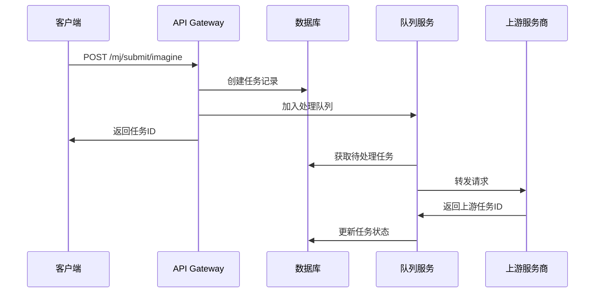
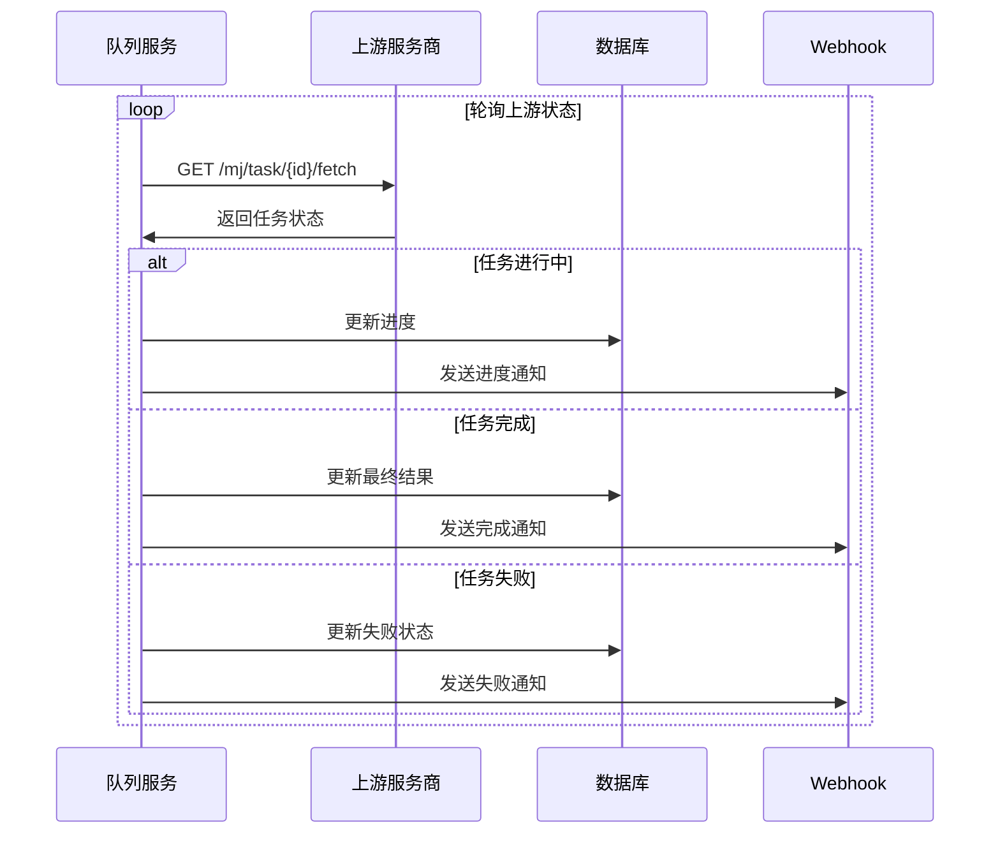

# Midjourney 任务转发实现

本文档介绍 AI API Gateway 中 Midjourney 任务的转发实现机制。

## 🎯 实现方案

### 架构概述

```
客户端请求 → API Gateway → 创建任务 → 队列处理 → 数据库查询提供商 → 转发到上游 → 轮询结果 → 更新任务状态
```

### 核心特性

1. **保留任务管理** - 继续使用数据库存储任务状态和结果
2. **数据库驱动** - 通过数据库配置提供商，与 AI API 使用相同的模型-提供商关联机制
3. **直接转发** - 将请求参数直接转发给上游服务商
4. **异步处理** - 通过队列系统异步处理任务
5. **负载均衡** - 支持多个提供商的负载均衡和故障转移
6. **状态同步** - 轮询上游任务状态并同步到本地
7. **Webhook 支持** - 支持任务完成后的回调通知

## 🔧 配置说明

### 1. 启用 Midjourney 转发

在 `configs/config.yaml` 中配置：

```yaml
midjourney:
  enabled: true  # 启用 Midjourney 转发
  base_url: "https://api.302.ai"  # 上游服务商 API 地址
  api_key: "your-302ai-api-key"   # 上游服务商 API 密钥
  timeout: 300  # 请求超时时间（秒）
```

### 2. 配置说明

- `enabled`: 是否启用转发功能
  - `true`: 使用真实的上游服务转发
  - `false`: 使用模拟处理（开发测试用）

- `base_url`: 上游服务商的 API 基础地址
  - 302AI: `https://api.302.ai`
  - 其他服务商: 根据实际情况配置

- `api_key`: 上游服务商的 API 密钥
  - 需要在上游服务商处申请获得

- `timeout`: 单个请求的超时时间
  - 建议设置为 300 秒（5分钟）

## 🚀 工作流程

### 1. 任务提交流程



### 2. 任务处理流程



## 📝 API 使用示例

### 1. 图像生成请求

```bash
curl -X POST "http://localhost:8080/mj/submit/imagine" \
  -H "mj-api-secret: your-api-key" \
  -H "Content-Type: application/json" \
  -d '{
    "prompt": "A beautiful cat sitting in a garden",
    "botType": "MID_JOURNEY",
    "notifyHook": "https://your-domain.com/webhook"
  }'
```

**响应:**
```json
{
  "code": 1,
  "description": "提交成功",
  "properties": {},
  "result": "task-uuid-12345"
}
```

### 2. 查询任务状态

```bash
curl -X GET "http://localhost:8080/mj/task/task-uuid-12345/fetch" \
  -H "mj-api-secret: your-api-key"
```

**响应:**
```json
{
  "id": "task-uuid-12345",
  "action": "imagine",
  "status": "SUCCESS",
  "progress": "100",
  "submitTime": 1703123456789,
  "finishTime": 1703123556789,
  "imageUrl": "https://cdn.example.com/generated-image.png",
  "prompt": "A beautiful cat sitting in a garden",
  "buttons": [
    {"customId": "upsample1", "label": "U1", "type": 2},
    {"customId": "upsample2", "label": "U2", "type": 2},
    {"customId": "variation1", "label": "V1", "type": 2},
    {"customId": "variation2", "label": "V2", "type": 2}
  ]
}
```

## 🔄 转发机制详解

### 1. 请求转发

当队列处理器处理任务时：

1. **获取任务参数** - 从数据库中读取任务的请求参数
2. **构造上游请求** - 将参数转换为上游 API 格式
3. **转发请求** - 发送到上游服务商
4. **处理响应** - 解析上游返回的任务ID

### 2. 状态轮询

获得上游任务ID后：

1. **定期轮询** - 每5秒查询一次上游任务状态
2. **进度更新** - 将上游进度同步到本地任务
3. **结果处理** - 任务完成后保存最终结果
4. **Webhook通知** - 发送状态变更通知

### 3. 错误处理

- **网络错误** - 自动重试，最多重试3次
- **上游错误** - 记录错误信息，标记任务失败
- **超时处理** - 超过5分钟未完成的任务标记为超时

## 🎛️ 运维管理

### 1. 监控指标

- **任务提交率** - 每分钟提交的任务数量
- **任务成功率** - 成功完成的任务比例
- **平均处理时间** - 从提交到完成的平均时间
- **队列长度** - 待处理任务的数量

### 2. 日志记录

系统会记录以下关键日志：

```
[INFO] Forwarding imagine request to upstream
[INFO] Upstream task submitted successfully
[DEBUG] Upstream task status: IN_PROGRESS
[INFO] Job completed successfully
[ERROR] Failed to forward request: connection timeout
```

### 3. 故障排除

**常见问题:**

1. **上游API密钥无效**
   - 检查配置文件中的 `api_key` 是否正确
   - 确认密钥在上游服务商处是否有效

2. **网络连接问题**
   - 检查 `base_url` 配置是否正确
   - 确认网络连接是否正常

3. **任务处理缓慢**
   - 检查上游服务商的服务状态
   - 考虑增加队列工作进程数量

## 🔧 开发配置

### 1. 开发环境

开发时可以禁用转发功能：

```yaml
midjourney:
  enabled: false  # 使用模拟处理
```

### 2. 测试环境

测试时可以使用测试API：

```yaml
midjourney:
  enabled: true
  base_url: "https://test-api.302.ai"
  api_key: "test-api-key"
```

### 3. 生产环境

生产环境使用真实配置：

```yaml
midjourney:
  enabled: true
  base_url: "https://api.302.ai"
  api_key: "${MJ_API_KEY}"  # 从环境变量读取
```

## 📊 性能优化

### 1. 队列配置

- **工作进程数量** - 根据并发需求调整
- **轮询间隔** - 平衡实时性和API调用频率
- **超时设置** - 根据上游服务特性调整

### 2. 缓存策略

- **任务状态缓存** - 减少数据库查询
- **结果缓存** - 缓存已完成任务的结果

### 3. 限流保护

- **上游API限流** - 避免超出上游服务商的限制
- **本地限流** - 保护系统资源

## 🔐 安全考虑

1. **API密钥保护** - 使用环境变量存储敏感信息
2. **请求验证** - 验证转发请求的合法性
3. **日志脱敏** - 避免在日志中记录敏感信息
4. **访问控制** - 限制对管理接口的访问

## 📈 扩展性

该转发机制支持：

- **多上游服务商** - 可以配置多个不同的服务商
- **负载均衡** - 在多个上游服务间分配请求
- **故障转移** - 主服务商不可用时切换到备用服务商
- **自定义处理** - 支持特定业务逻辑的定制化处理
